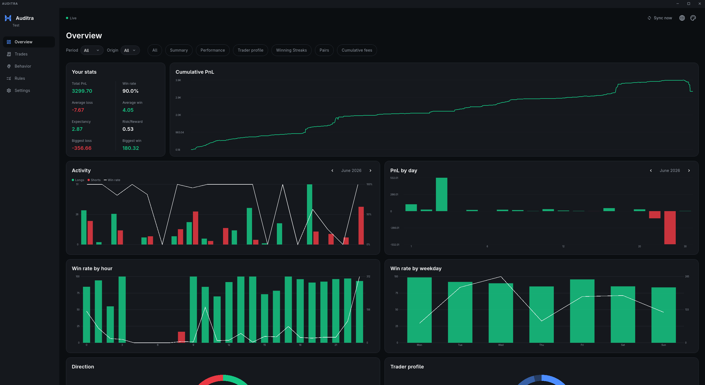
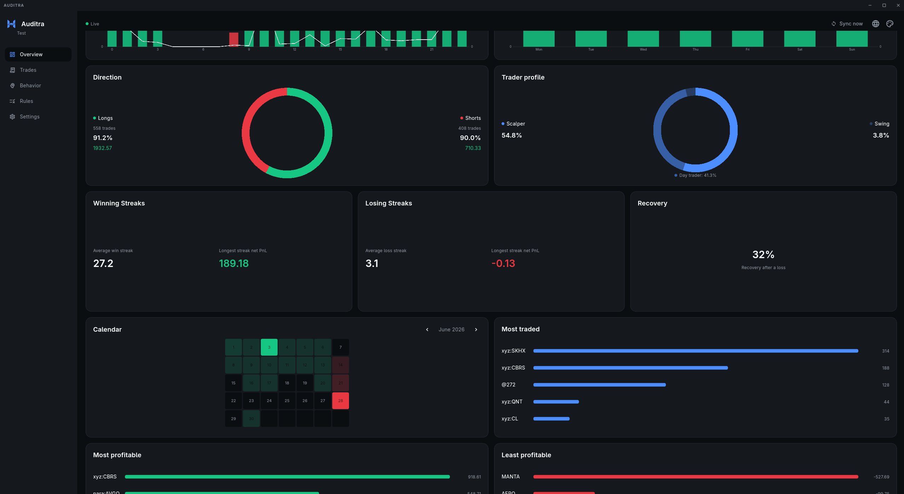

# Auditra

Desktop trade analytics dashboard for Hyperliquid wallets. Point it at a
public wallet address and it builds a full picture of your trading: PnL,
win rate, drawdown, time patterns, behavior, fees, and rule breaches. No
API keys, no account, no signing. It only reads public on-chain data.

Built as an improved, standalone version of TradeAudit, targeting
Hyperliquid instead of centralized exchanges.

## Download

Prebuilt binaries for Linux, Windows and macOS are on the
[Releases page](https://github.com/MrCrypPrivacy/Auditra/releases) the one for your OS, unzip it, and run it. No Flutter, no build step

## Screenshots





## Features

- PnL total, win rate, expectancy, risk/reward ratio, max drawdown ($ and %)
- Daily activity, PnL by day, win rate by hour and by weekday, long vs
  short breakdown
- Trader profile (scalper, day trader, swing) reconstructed from position
  duration, winning and losing streaks, recovery rate after a loss
- Pair ranking: most traded, most and least profitable
- Fees: total, daily, cumulative, PnL-per-fee ratio, monthly summary
- Custom trading rules (no trading on a given weekday, max trades per day,
  no trading in a time range) with breach detection against your real
  history and a proactive alert on the dashboard
- Multi-wallet support, each with its own history, notes, and rules
- Live sync via Hyperliquid's WebSocket feed, plus manual sync
- Per-trade notes, JSON/CSV export and import
- 10 languages: English, Spanish, French, German, Italian, Portuguese,
  Russian, Arabic, Mandarin, Japanese

## Build from source

Only needed if you want to modify the code. Most people should just use
the prebuilt binaries above.

- Flutter 3.3 or newer, with desktop support enabled
- On Linux: `clang`, `cmake`, `ninja-build`, `gtk3-devel` (or your
  distribution's equivalent)

```bash
git clone https://github.com/MrCrypPrivacy/Auditra.git
cd Auditra
flutter create --platforms=linux,windows,macos .
flutter pub get
flutter run -d linux
```

`flutter create` fills in the native platform folders, which aren't part
of this repository's history (see `.gitignore`). `flutter pub get` also
generates the localization classes under `lib/l10n/generated/`.

Tests:

```bash
flutter test
```

## Linux desktop icon

Flutter doesn't embed a taskbar icon into the Linux build the way it does
for Windows and macOS. Run `linux/install.sh` once (after your first
release build) to install Auditra's icon and a proper `.desktop` entry for
your user, pointing at the right paths on your machine:

```bash
chmod +x linux/install.sh
./linux/install.sh
```

Safe to run again after every update. To remove it:

```bash
./linux/uninstall.sh
```

This never touches your wallets, trade history, notes, or rules, only
the program itself. Pass `--with-data` if you also want to wipe those.

## Data and privacy

Auditra has no backend and no database of its own. All data (fills,
notes, rules, wallet list, preferences) is stored locally as JSON files
in your OS's application support directory, one file per wallet and data
type. Nothing is uploaded anywhere except the read-only requests to
Hyperliquid's public API and WebSocket feed for the wallet address you
enter.

## Tech stack

- Flutter Desktop, no third-party charting library: every chart is a
  hand-written `CustomPainter`
- `window_manager` for the custom title bar and window sizing
- `web_socket_channel` for the live Hyperliquid fills subscription
- `file_selector` for native export/import dialogs
- `path_provider` for local JSON storage

## Project structure

```
lib/
├── app.dart                 # MaterialApp, theme/locale controllers, title bar
├── main.dart                 # bootstrap, window setup
├── core/
│   ├── network/               # Hyperliquid REST and WebSocket clients, export/import
│   ├── storage/               # local JSON stores, reset service
│   ├── rules/                 # trading rules and breach evaluation
│   ├── filters/                # period filter (all/today/week/month/year)
│   ├── format/                 # number and duration formatting
│   ├── theme/                  # themes and theme controller
│   └── l10n/                   # locale controller and translation files
├── features/
│   ├── onboarding/              # wallet input, launch flow
│   ├── settings/                # settings screen
│   └── dashboard/
│       ├── domain/               # Fill model
│       ├── application/          # metrics computation, cached by fingerprint
│       └── presentation/         # screens and chart widgets
└── shared/widgets/              # sidebar, title bar, reusable buttons/selectors
```

## License

MIT. See `LICENSE`.
